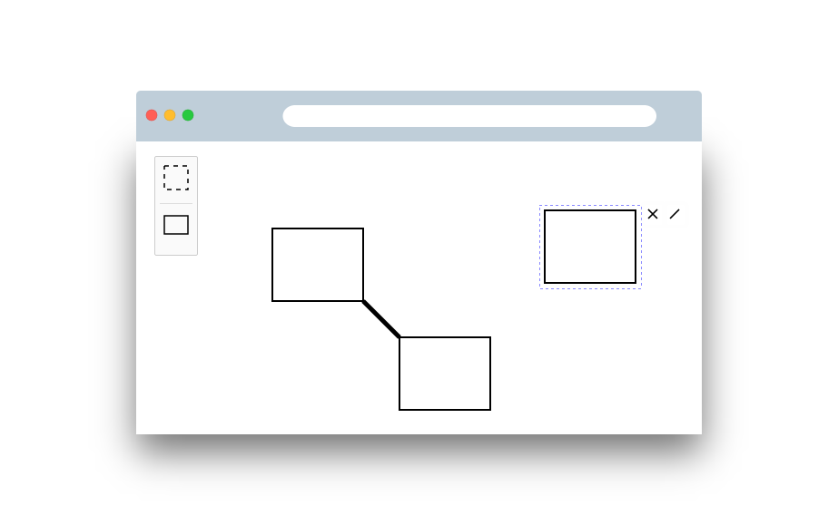

# diagram-js Editor Example

A simple diagram editor built with diagram-js.



You can use this as a starting point for your own diagram-js based editor or look into [tools built on top of it](https://github.com/bpmn-io/diagram-js#built-with-diagram-js) for inspiration.


## Example Structure

```plain
editor/
├─ public/              <-- simple web page using the editor
├─ src/                 <-- editor source
|  ├─ providers/        <-- a custom editor module
|  └─ index.js          <-- editor entry point
└─ webpack.config.js    <-- configuration to bundle the editor into
                            the public/vendor directory
```


## Build the Example

Initialize the project dependencies via

```
npm install
```

Bundle the editor contained in `src` and output it to `public/vendor`:

```
npm run all
```

Start the development setup, opening the example app and rebuild on changes:

```
npm run dev
```


## Licence

MIT